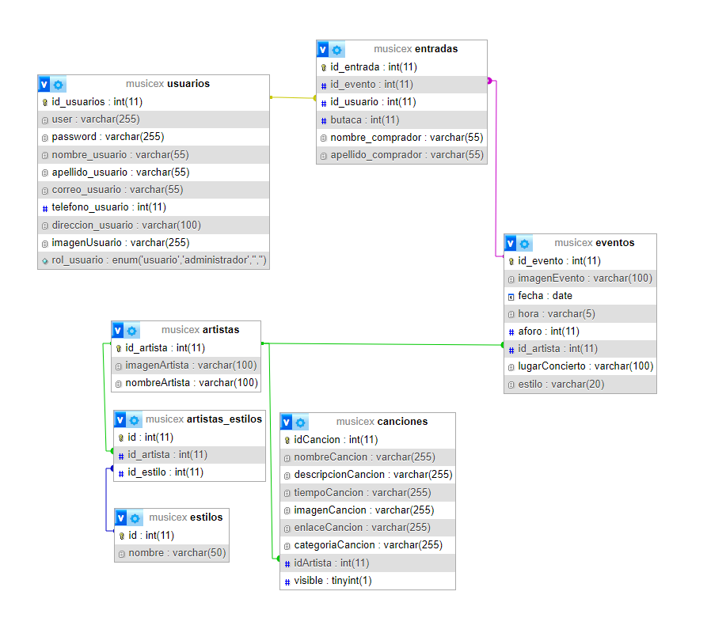

## Cosas mínimas del proyecto:

- ✅ Hacer la página Home, Descubre y Reserva. Que se carguen dinámicamente usando AJAX.
- ✅ Poner el iFrame con un video de Youtube en la parte superior derecha del Home.
- ✅ Hacer un login que es una pantalla modal, que al poner manolo@gmail.com, muestre Hola Manolo! arriba a la derecha. 
- ✅ La página Descubre que cargue los estadios del .json.
- ✅ Que al pulsar alguno de los estilos, por ejemplo Pop, cargue de BD los artistas con este estilo y cree dinámicamente las tarjetas.

### Cosas para subir del 5:

- ✅ Almacenar los asientos ocupados en BD y que al volver a entrar en la página busque los asientos ocupados y los ponga en rojo.
- ✅ Crear una tabla en BD con varios usuarios y que si no existe el usuario en BD, no deje hacer Login.

-  Cualquier cosa que quieras añadir, como modificaciones o borrado en BD.
    - ✅ Los estilos (generos musicales), estan almacenados en BD y se cargan en los botones dinamicamente.
    - ✅ Las tarjetas (eventos) se pueden seleccionar y aparecera el contenido de esta en la pagina comprar.
    - ✅ Las canciones de Destacados, Tendencias y Nuevos se cargan dinamicamente de BD
    - ✅ Al pulsar una cancion se reproduce en el iFrame
    - ✅ 3 Roles Usuario (Invitado, Usuario y Administrador)
    - ✅ La compra de butacas tienen 5 estados 
            
            -Disponible: El Asiento esta libre para poder ser reservado

            -Seleccionado: El Asiento esta reservado para ser reservado
            
            -Reservado: El Asiento se añade a la lista de Reservados (Lista de compra)
            
            -Comprado: El Asiento ha sido comprado por nosotros
        
            -Ocupado: El Asiento esta ocupado por otra persona
    
    - ✅ Se pueden comprar entradas para varios eventos simultaneamente 
    - ✅ Se crea una nueva estructura de base de datos

        
    
    - ✅ Se pueden registrar nuevos usuarios
    - ✅ Formulario de registro con comprobación de campos de forma dinamica
    
    -  En la pagina Conciertos apareceran las entradas compradas 
    -  El usuario Administrador podrá gestionar los eventos, las canciones y los generos 
    -  Los usuarios pueden editar configuracion basica del perfil
    -  El Cuadro de busqueda es funcional
    -  Contenido Dockerizado